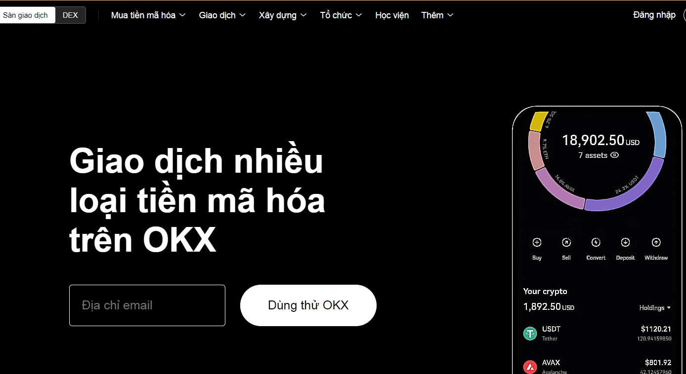
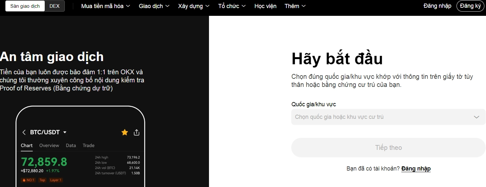
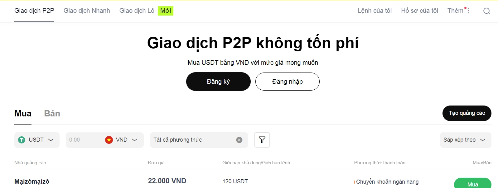

# OKX交易所评测：注册、充值与提现完整指南

---

越南用户想找一个靠谱的加密货币交易平台？别急着下手。市场上交易所那么多，有的安全系数高，有的手续费低，有的功能花哨但实际体验一般。OKX（原OKEx）算是老牌玩家了，全球交易量长期排前五，支持300多种币种交易。但问题来了：它真的适合你吗？注册流程复杂吗?充值提现会不会踩坑？

这篇文章就是要把这些问题说清楚。我们会用最直白的语言，告诉你OKX到底怎么用，哪些功能值得关注，哪些坑需要避开。不吹不黑，只聊实际操作。

---

## OKX是什么？一个老牌交易所的现状

OKX的前身叫OKEx，2017年由Star Xu创立，总部设在塞舌尔。它隶属于OK Group，这家公司旗下还有Okcoin这个交易所。目前OKX在100多个国家都有用户，但美国市场因为监管原因进不去。

这个平台主要干什么？说白了就是让你买卖加密货币。比如你想用USDT买比特币，或者把以太坊换成其他山寨币，都能在这里操作。除了基础的现货交易，OKX还提供：

**杠杆交易**：最高10倍杠杆，适合想放大收益（当然风险也放大）的人。

**合约交易**：期货、期权、永续合约都有，杠杆最高能开到125倍。这东西赚得快，亏得更快，新手慎碰。

**理财产品**：类似银行存定期，把币存进去吃利息。年化收益看币种，一般比银行高，但也有波动风险。

**NFT市场**：想买卖数字艺术品或者游戏道具，这里也能搞定。

**Web3钱包**：支持30多条公链，可以玩DeFi、铸造NFT，还能对接各种去中心化应用。

有人可能会问：OKX和那些"水龙头"网站（比如Freebitco.in）有什么区别？

简单说，Freebitco.in是让你通过做任务、玩游戏慢慢攒点Satoshi（比特币的最小单位），适合想零成本体验加密货币的人。OKX则是正经的交易平台，交易量大、功能全，更适合真金白银地买卖投资。

## OKX靠谱吗？看数据说话

很多人第一次听说OKX，最关心的就是安全性。毕竟币圈黑天鹅事件太多了，FTX暴雷还历历在目。

先说好消息：OKX在CoinMarketCap上长期排进全球前五，交易量摆在那儿。它每个月公布储备证明（Proof of Reserves），比如比特币的储备率达到102%，意思是用户的币确实有对应的资产背书，不是空手套白狼。而且到目前为止，OKX没遭遇过大规模黑客攻击，这点比某些被盗过的交易所强。

但也有不那么完美的地方：OKX没拿到FCA（英国金融行为监管局）或其他主流金融机构的牌照。这不代表它不合规，只是说在监管层面，它的底气不如那些有牌照的平台。对风险承受能力低的人来说，这是需要考虑的因素。

👉 [想快速体验OKX的交易功能？用邀请码62834398注册，新人福利直接到账](https://www.okx.com/join/62834398)

## 实操指南：从注册到提现全流程

### 第一步：注册账户

打开OKX官网或下载APP，点"注册"按钮。可以用邮箱或手机号注册，建议选邮箱，因为后续改密码、找回账户都方便些。

填完基本信息后，系统会发验证码到你邮箱或手机。输入验证码，设置个强密码（至少8位，包含大小写字母和数字），就算注册成功了。

### 第二步：完成KYC认证

想在OKX正常交易，必须过KYC（身份验证）这关。不验证的话，提现额度会被限制得很死。

具体操作：进入"个人中心"，找到"身份认证"，按提示上传身份证或护照照片。拍照时注意光线充足，四个角都要拍清楚，否则系统可能识别不出来。审核时间一般几分钟到几小时不等，高峰期可能慢一些。

### 第三步：充值

验证通过后就能充值了。OKX支持两种充值方式：

**法币购买**：直接用越南盾或美元买币。点"买币"，选择想买的币种（比如USDT），输入金额，选择支付方式（银行卡、第三方支付等），按流程操作就行。注意，法币购买通常有手续费，大概在1%-3%之间。

**加密货币转账**：如果你在其他交易所或钱包里已经有币，可以直接转到OKX。点"资产">"充值"，选择币种和网络（比如比特币选Bitcoin主网，USDT可以选TRC20或ERC20），复制充值地址，然后在原钱包发起转账。记住，网络选错了币就丢了，没法找回。

### 第四步：开始交易

充值到账后，就能买卖了。最简单的是现货交易：

进入"交易">"现货"，搜索交易对（比如BTC/USDT），输入想买的数量或金额，点"买入"。卖出操作同理。

如果想玩得更复杂点，可以试试限价单（指定价格成交）或止损单（价格跌到某个点自动卖出）。新手建议先从市价单（立刻按当前价成交）开始熟悉。

### 第五步：提现

想把币提到自己钱包或其他交易所？点"资产">"提现"，选择币种和网络，输入目标地址和数量，确认后输入双重验证码（邮箱+手机），提现请求就提交了。

提现通常有手续费，比如比特币可能收0.0004 BTC，USDT在TRC20网络上只要1 USDT。到账时间看网络拥堵情况，快的话几分钟，慢的话可能几小时。

## 进阶功能：适合想深入玩的人

### 合约交易

如果你对市场有判断，想用小资金博大收益，可以试试合约。进入"交易">"合约"，选择币种，设置杠杆倍数（2倍到125倍），开多（看涨）或开空（看跌）。

但注意，杠杆是双刃剑。开100倍杠杆意味着价格波动1%，你的本金就归零了。玩合约前最好先模拟交易练手，别上来就梭哈。

### 交易机器人

OKX提供网格交易和定投机器人。网格适合震荡行情，低买高卖自动套利；定投适合长期看好某个币，分批建仓降低成本。

进入"交易">"交易机器人"，选类型，设置参数（比如价格区间、网格数量），启动后机器人会自动跑。懒人福音，但别指望躺赢，设置不当照样亏钱。

### 推荐返佣

OKX有推荐计划。进入"更多">"邀请好友"，生成你的专属链接，分享给朋友。他们通过你的链接注册并交易后,你能拿到手续费返佣。如果你朋友多，这也是一笔不错的被动收入。

👉 [用邀请码62834398注册OKX，享受更低的交易手续费和新人专属福利](https://www.okx.com/join/62834398)

## 几个需要注意的点

**手续费别忽略**：现货交易手续费在0.08%-0.1%，合约在0.02%-0.05%。如果持有OKB（OKX的平台币），手续费能打折。频繁交易的人建议囤点OKB。

**风险自己扛**：加密货币价格波动大得离谱，一天涨跌20%都是常事。投之前问自己：这钱亏光了我能接受吗？不能就别碰。

**遇到问题找客服**：APP里有"支持"入口，或者发邮件到support@okx.com。客服响应速度一般，紧急情况最好直接打电话（如果有提供）。

---

## 总结：OKX适合谁？

如果你是新手，OKX的界面和功能可能刚开始有点复杂，但花点时间熟悉后，会发现它覆盖的场景挺全的——从简单买币到高级合约，从理财生息到NFT交易，基本能满足不同阶段的需求。

如果你是老手，OKX的流动性和交易深度都不错,合约工具也齐全，算是个趁手的平台。唯一要注意的是,它没有主流监管牌照，介意这点的人可以再对比其他选择。

不管怎么说，OKX目前在越南用户中口碑还可以，支持越南盾充值也方便。想入场试试，记得用邀请码62834398注册，能省不少手续费。最后再强调一遍：币圈风险高，别把身家都押上，玩得起才玩。
